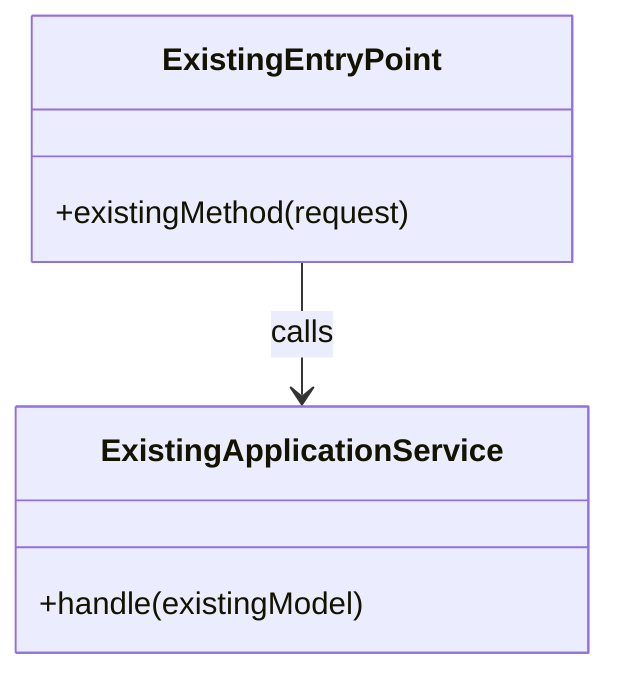

# Technical Plan: <Story Title>

## Plan Profile

Recommended or selected profile: `Standard`

Reason: TBD

## Goal

Describe the technical outcome and map it to Acceptance Criteria from `story.md`.

| Acceptance Criterion | Technical outcome |
|---|---|
| AC1 | TBD |

## DC Checklist

Prepare a concise BA/QA/Developer walkthrough for confirming the delivered Story end to end. Derive each item from confirmed Acceptance Criteria, Business Rules, relevant JIRA context, and inspected repository behavior. Include material data/sync/configuration prerequisites, primary flow, combinations, persistence/read-back, boundary/no-change behavior, and permissions when relevant. Each item must be one short, observable result; do not list code edits, shell commands, or generic test tasks.

- [ ] TBD

## Business Flow Diagram (Optional)

Add a Mermaid flowchart only when cross-system flow, scheduled or asynchronous processing, state transitions, or complex filtering is material to understanding the business flow. Omit this section's diagram for a simple local change.

## Technical Clarifications

Record confirmed answers from progressive technical Q&A. Do not keep important decisions only in chat.

| Question | Confirmed answer | Impact on plan |
|---|---|---|
| TBD | TBD | TBD |

## Repository Evidence

Include only evidence that materially supports a technical decision. Prefer a repository path and symbol over pasted code.

| Technical decision | Repository evidence | What it proves |
|---|---|---|
| TBD | `repository/path → symbol` | TBD |

## Domain Concept And Naming Contract

This is an implementation contract, not a brainstorming list. Reuse the established model when the Story term means the same thing. Do not create a parallel concept, table, class, enum, API field, method, or variable merely because the Story uses a different label.

| Business term in Story | Existing concept / evidence in repository | Relationship | Canonical implementation names | Explicitly not a separate concept |
|---|---|---|---|---|
| TBD | File, API, table, or recent refactor | Same / specialization / new | Class, method, field, property, and key variable names | TBD |

## Impacted Repositories

| Repository | Role in this delivery | Change summary | Runtime / verification level |
|---|---|---|---|
| TBD | TBD | TBD | TBD |

## Architecture And Module Placement

Describe where the change belongs in each repository and why.

```text
Example:
mbpass-admin -> controller validation + request mapping
mbpass-business -> application service + repository query
```

## Implementation Interaction / Class Diagram

Required for a non-trivial behavior, data-model, or multi-class change. Show existing and changed classes/components, their entry methods, and the data hand-off. For a simple local change, state why it is not required.



## Method, Property, And Variable Contract

List every changed or new public method, API property, persistence field, DTO property, and semantic local variable that could otherwise be confused with an existing concept. Reuse existing names where the concept is unchanged.

| Location | Identifier | Kind | Type / shape | Meaning and relationship to existing model |
|---|---|---|---|---|
| `path/to/File` | `existingMethod` | method | `(ExistingType) -> Result` | TBD |

## Repository Conventions And Architecture Guards

Document the conventions observed in each impacted repository. Existing repository patterns and guard tests are authoritative; do not create a parallel layering approach for this story.

| Repository | Existing layers / module boundary | Existing style to follow | Architecture guard test / rule | Delivery action |
|---|---|---|---|---|
| TBD | TBD | TBD | TBD or `None found` | TBD |

## API And Contract Changes

### New or changed endpoints

| Method | Path | Repository | Auth / permission | Request | Response | Compatibility notes |
|---|---|---|---|---|---|---|
| TBD | TBD | TBD | TBD | TBD | TBD | TBD |

### Caller impact

- TBD or `None`

### Breaking changes

- TBD or `None`

## Data Model And Migration Plan

Do not introduce database foreign keys. Use application-level relationship validation and ordinary indexes where required by the query or lifecycle.

| Repository | Table / field / migration | Change | Backward compatible | Rollback |
|---|---|---|---|---|
| TBD | TBD | TBD | TBD | TBD |

## Permission And Data Scope

Complete this section whenever the change reads or mutates data, exposes an endpoint, runs a job, or changes an integration. Reuse the repository's existing authorization and audit conventions.

| Surface | Actor / caller | Permission / role | Tenant, dealer, or ownership scope | Audit / logging | Verification |
|---|---|---|---|---|---|
| TBD or `No permission impact` | TBD | TBD | TBD | TBD | TBD |

## Integration And Failure Handling

| Integration point | Change | Failure behavior | Retry / fallback |
|---|---|---|---|
| TBD | TBD | TBD | TBD |

## Configuration And Secrets

| Repository | Key / file | Change | Default | Secret handling |
|---|---|---|---|---|
| TBD | TBD | TBD | TBD | TBD |

## File-Level Change Plan

### <repository-name>

| File | Change |
|---|---|
| TBD | TBD |

## Implementation Steps

1. Step 1 - repository, files, and expected result.
2. Step 2 - repository, files, and expected result.
3. Step 3 - verification and PR boundary.

Each step must be concrete enough for the Development Loop to execute without guessing.

## Verification Plan

Plan tests based on the actual repository setup. Include unit tests, integration tests, and architecture guards only when the repository already supports them or the story explicitly requires adding them. App/PHP/frontend projects default to syntax/type/lint and explicitly allowed focused tests; do not plan heavy environment-dependent builds by default.

| Level | Repository | Existing capability / guard discovered | Command or manual check | Expected result | Notes |
|---|---|---|---|---|---|
| Compile / syntax | TBD | TBD | TBD | TBD | TBD |
| Static / architecture | TBD | TBD | TBD | TBD | TBD |
| Unit | TBD | TBD | TBD | TBD | TBD |
| Integration | TBD | TBD | TBD | TBD | TBD |

## Runtime Profiles

| Repository | Dockerfile / profile source | Java / Node / PHP version | Commands allowed | Commands skipped |
|---|---|---|---|---|
| TBD | TBD | TBD | TBD | TBD |

<!-- Remove these comment markers for a UI Story, then complete every cell.

## Visual Delivery Contract

Omit this section for non-UI Stories. A UI plan cannot be approved while any required cell remains `TBD`.

### Design Source

| Screen | Figma file | Node ID | Approved reference |
|---|---|---|---|
| TBD | TBD | TBD | `assets/TBD.png` |

### Runtime

| Property | Value |
|---|---|
| Repository | TBD |
| Runtime profile | TBD |
| Platform | TBD |
| Device | TBD |
| Navigation | TBD |
| Authentication | TBD |

### Visual State Matrix

| Screen | State | Fixture | Reference | Stable marker |
|---|---|---|---|---|
| TBD | Default | TBD | `assets/TBD.png` | TBD |

### Figma-to-Code Component Mapping

| Figma component | Existing implementation | Delivery action |
|---|---|---|
| TBD | TBD | Reuse / Extend / Create local Story component |

### Platform Rules

- Reuse existing tokens and styling conventions.
- Settle animations and mask only explicitly approved dynamic areas.
- Preserve accessibility, responsive behavior, and platform safe areas.

### Visual Verification

| Screen | State | Comparison | Maximum difference |
|---|---|---|---|
| TBD | Default | Full content area | `1%` |

-->

## Observability And Support

| Area | Plan |
|---|---|
| Logs | TBD |
| Metrics / audit | TBD |
| Support diagnostics | TBD |

## Rollback / Release Notes

- TBD or `Not required`

## Risks

| Risk | Impact | Mitigation |
|---|---|---|
| TBD | TBD | TBD |

## Refactoring Notes

Only record refactoring here when it affects architecture, public API behavior, or team-level understanding.

## Out Of Scope

- TBD
