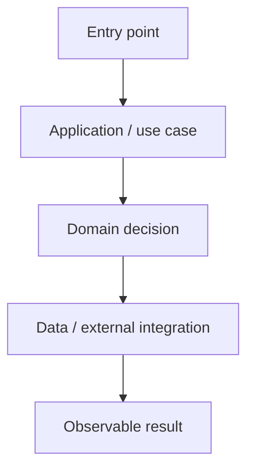
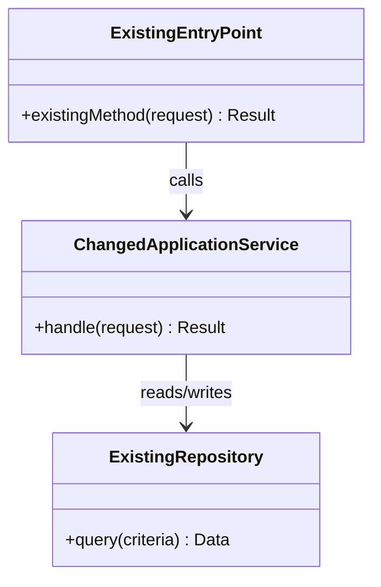

# Technical Plan: <Story Title>

## 1. Scope & DC Checklist

Plan profile: `Light` / `Standard` / `Complex`

### Goal

Describe the technical outcome in one or two sentences.

### Acceptance Criteria Mapping

| Acceptance Criterion | Technical outcome |
|---|---|
| AC1 | TBD |

### In Scope

- TBD

### Out of Scope

- TBD

### DC Checklist

Write short, observable BA/QA/Developer checks derived from the confirmed Story, business rules, repository behavior, and relevant Jira context. Cover prerequisites, the primary flow, important combinations, persistence/read-back, boundaries/no-change behavior, permissions, and UI states when relevant. Do not list code edits, shell commands, or generic test tasks.

- [ ] TBD

## 2. Baseline & Decisions

### Repository Evidence

Record only facts that support a decision. Prefer `repository/path → symbol` and a short explanation over pasted code.

| Repository evidence | Current behavior | Decision supported |
|---|---|---|
| `repository/path → symbol` | TBD | TBD |

### Confirmed Decisions

Record decisions confirmed in Technical Loop. If a decision changes business behavior, return to Business Loop instead of changing `story.md` here.

| Question / decision | Confirmed answer | Impact |
|---|---|---|
| TBD | TBD | TBD |

### Preconditions & Assumptions

| Item | Evidence / owner | Handling if false |
|---|---|---|
| Base branch, dependency Story, data source, or environment | TBD | TBD |

## 3. Design & Architecture

Describe the end-to-end behavior, module placement, data hand-off, and failure boundaries. Reuse existing architecture; do not introduce a parallel layering approach.

### End-to-End Flow

For `Complex`, this flowchart is required. For `Standard`, include it when there is a cross-module, cross-service, scheduled, asynchronous, stateful, or filtering flow. `Light` may omit it.

```mermaid
flowchart TB
    Entry["Entry point"] --> Application["Application / use case"]
    Application --> Domain["Domain decision"]
    Domain --> Data["Data / external integration"]
    Data --> Result["Observable result"]
```

Show success, failure, retry/fallback, and important state transitions in the diagram when they affect delivery behavior.

### Components & Class Diagram

For `Complex`, this diagram is required. Show existing and changed components/classes, entry methods, important parameters, and data hand-off. Use a component diagram instead when classes would obscure a cross-service flow.

```mermaid
classDiagram
    class ExistingEntryPoint {
        +existingMethod(request) Result
    }
    class ChangedApplicationService {
        +handle(request) Result
    }
    class ExistingRepository {
        +query(criteria) Data
    }
    ExistingEntryPoint --> ChangedApplicationService : calls
    ChangedApplicationService --> ExistingRepository : reads/writes
```

### Module Placement & Conventions

| Repository | Module / layer | Existing pattern to reuse | New or changed component |
|---|---|---|---|
| TBD | TBD | `repository/path → symbol` | TBD |

### Visual Delivery Contract (UI Stories Only)

For Figma-backed UI, inspect every referenced node with Figma MCP and record the reproducible design snapshot and approved reference. Keep runtime, authentication, state matrix, component mapping, responsive/accessibility rules, and visual comparison thresholds here.

| Screen / state | Figma node | Design snapshot | Reference | Runtime / stable marker |
|---|---|---|---|---|
| TBD | TBD | `assets/TBD.design.md` | `assets/TBD.png` | TBD |

## 4. Change Contract & Implementation

This section combines naming, API, data, permission, integration, file-level change, and implementation details. Include every item that changes or could be misunderstood; write `No impact` with a reason when a contract is not affected.

### Identifier Contract

Before approval, list every new or changed method, API property, persistence field, DTO property, UI state, and semantic local/query variable involved in the implementation. Reuse existing names when the concept is unchanged.

| Location | Identifier | Kind | Type / shape | Meaning / relationship |
|---|---|---|---|---|
| `path/to/File` | `methodOrVariable` | method / field / state / variable | TBD | TBD |

### API & Caller Contract

| Method | Path / event | Request / input | Response / output | Auth / scope | Compatibility |
|---|---|---|---|---|---|
| TBD | TBD | TBD | TBD | TBD | TBD |

### Data, Configuration & Integration Contract

| Area | Location / key | Change | Failure / retry | Migration / rollback |
|---|---|---|---|---|
| Data model | TBD | TBD | TBD | TBD |
| Permission / data scope | TBD | TBD | TBD | TBD |
| Configuration / secrets | TBD | TBD | TBD | TBD |
| External integration | TBD | TBD | TBD | TBD |

Do not introduce database foreign keys unless the repository standard explicitly requires them. Use existing authorization, audit, migration, and integration conventions.

### File-Level Change Plan

| Repository | File / module | Change | Depends on |
|---|---|---|---|
| TBD | `path/to/File` | TBD | TBD |

### Implementation Steps

1. Repository, file/module, concrete change, and expected result.
2. Repository, file/module, concrete change, and expected result.
3. Persistence/API/integration wiring and failure behavior.
4. Verification and delivery boundary.

Steps must be executable without guessing and must follow dependency order.

## 5. Verification, Performance & Delivery

### Verification Matrix

| AC / area | Scenario | Existing capability / command or manual check | Expected result |
|---|---|---|---|
| AC1 | Main flow | TBD | TBD |
| Boundary | Empty / invalid / no-change case | TBD | TBD |
| Regression | Existing behavior | TBD | TBD |

Include focused compile/syntax, static/architecture, unit, integration, migration, UI interaction, and visual checks only when applicable and supported by the repository.

### Performance Assessment

Required for any query, collection, batch, API, asynchronous job, scheduled flow, integration, or large UI list. For a simple local change, state `No material performance impact` and explain why.

| Dimension | Evidence / assumption | Design response | Verification |
|---|---|---|---|
| Data volume and growth | Current rows, payload size, or list cardinality | Index / pagination / batching / cache / no change | Query plan, benchmark, or focused test |
| Frequency and concurrency | Calls per request, job schedule, concurrent users | Rate limit / idempotency / queue / no change | Load or timing check |
| Latency / timeout | Existing SLO, timeout, or user expectation | Query shape / async boundary / fallback | Timing or integration check |
| Resource usage | Memory, CPU, network, connection pool | Bound result / stream / limit / no change | Runtime observation |

Never invent precise performance numbers. If scale or SLO is unknown and could change the design, ask it in Technical Loop and keep the plan draft until resolved or explicitly recorded as an owner-approved assumption.

### Risks, Rollback & Release

| Risk | Impact | Mitigation | Rollback / release order |
|---|---|---|---|
| TBD | TBD | TBD | TBD |

Include observability/support diagnostics and runtime profiles here only when they affect execution or support. Do not create separate empty sections.

<!-- Profile rules:
- Light: use Scope, Baseline & Decisions, Change Contract, and Verification. Diagrams and full identifier inventory are optional.
- Standard: use all five sections; include diagrams and contracts when the change needs them.
- Complex: use all five sections; end-to-end flowchart, component/class diagram, full identifier contract, performance assessment, and rollback/release order are mandatory.
-->
